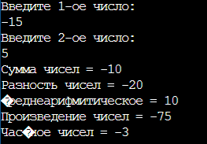

# Простейший калькулятор
**Git-репозиторий:** "Input-Output"

**Выполнил:** Типтев А.Л.

**Группа  :** Фт-200008

Программа "Простейший калькулятор" способна производить 5-ть операций:

*- складывать;*

*- вычитать;*

*- умножать;*

*- делить;*

*- находить среднеарифмитическое по модулю;*

Для каждой математической операции в коде программы предусмотренны функции, к которым она обращается. Ввод и вывод данных осуществляется через главную функцию программы.
Далее прикреплен скриншот кода главной функции последнего коммита программы.

**Язык программирования:** С++

**Среда программирования:** Онлайн-компилятор OnlineGBD

[Перейти на сайт](https://onlinegdb.com/5o-jzGmyJ)

Для запуска программы нажмите кнопку старт, и введите два числа.

#Пример компиляции программы

 
